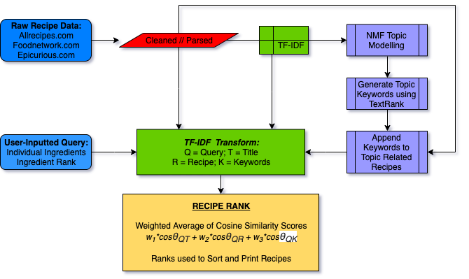

# Recipe Recommendation System :hamburger: :pizza:

### Overview
Home cooks everywhere always look for inspiration for new dishes to make. Searching through google helps, but google search queries return better results for just food categories (e.g. italian, japanese, baking, sauces, etc.). This recipe recommendation system intends to refine the recipe search process by allowing users to search recipes based on specific ingredients that they have or intend to use. The primary advantage for this search method is the ability to find recipes that incorporate disparate or unlikely ingredient pairings, allowing adventurous home cooks to find the cooking inspiration they otherwise couldn't find.

### Project Data
Data was pulled from github account rtlee9 who prescraped data from Allrecipes.com, Foodnetwork.com, and Epicurious.com. ~12500 recipes are included, including the title, ingredients, and instructions for each recipe.

### Goals:
1. Perform unsupervised Topic Modeling on the recipes to group recipes into categories. Then perform TextRank on the generated topics to produce keyword summarizations that can stand in as category names for each topic.
2. Create a search algorithm that utilizes similarity scoring to rank recipes according to the greatest similarity to the search query.

The general flow of data is visually summarized above. Starting with the raw recipe data, the recipes are cleaned, parsed, and TF-IDF vectorized by recipe. Using this vectorization, NMF topic modelling arbitrarily generates 50 topics. TextRank then pulls 25 keywords from each topic, and these keywords are appended to the top 2000 recipes in each topic. Recipe titles, ingredients, keywords, and instructions are then TF-IDF transformed along with an ingredients list, then a query similarity score is generated for each recipe and the recipes are returned based on similarity rank.

### Data Features:
- Recipe Title
- Recipe Ingredients
- Recipe Instructions
- Recipe Keywords (Generated from Topic Modeling and Textrank)

### Model Features:
- Search based on ingredients list \(e.g. \[ingredient 1, ingredient 2, ingredient 3\]\).
- Option to rank ingredients in order of ingredients. i.e. each successive ingredient in list is weighted incrementally less in the search query.
- Generated topic keywords for a select number of recipes helps refine recipe results.

### Search Performance and Detailed Parameter Selection
For more detailed analysis of the search performance please reference to the presentation slides included in the repo. Included in the presentation slides are the various model parameters and the model tuning and evaluation process.

### Summary of Conclusions
While this search algorithm works quite well, it unfortuantely underutilizes the generated keywords produced using topic modelling and TextRank. The search engine penalizes recipes without any appended keywords and the tuning process neglects to include around 10,000 recipes from receiving keywords. Also, because dense word embeddings were not used, it is required for keywords to be included in the search query for there to be any similarity to the keywords at all; a better model would to generate keywords using dense word embeddings so that search query ingredients can load similarity score based on a semantic similarity.

That being said, the cosine similarity scoring does return intriguing and useful recipes that fit the original purpose of the search algorithm. Different ingredients can be paired to find interesting and tasty recipes that one wouldn't normally encounter.
